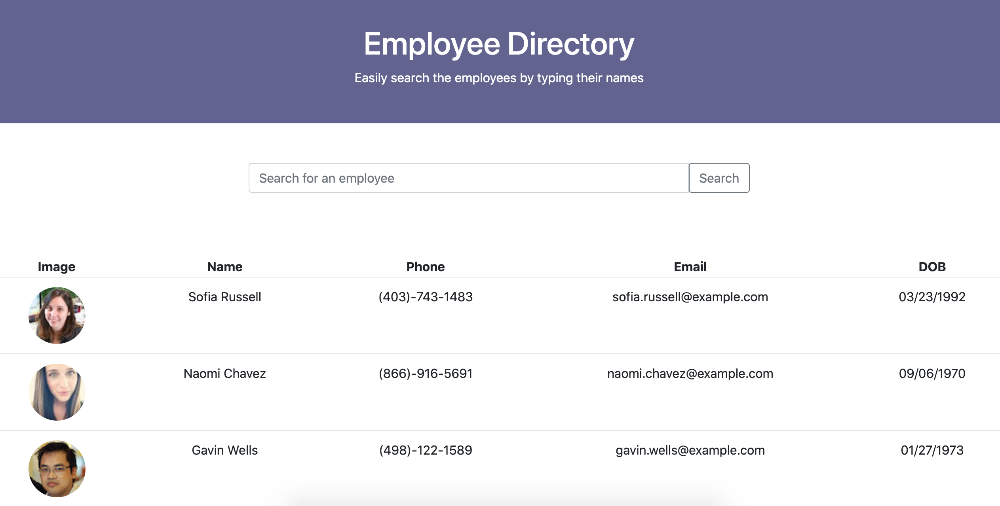

# React: Employee Directory

## Link to Deployed Application

Deployed URL: https://secure-brushlands-37715.herokuapp.com/

## Screenshot

## User Story

* As a user, I want to be able to view my entire employee directory at once so that I have quick access to their information.

## Business Context

An employee or manager would benefit greatly from being able to view non-sensitive data about other employees. It would be particularly helpful to be able to filter employees by name.

## Technologies

* ReactJS
* RandomUsers API
* MomentJS

